# 机器学习开源算法平台DemoHub

[TOC]

## 一、简介

DemoHub平台由北京交通大学Adam实验室开发，该平台汇总了经典和最新的开源算法，包括图像生成、图像分类、目标检测、图像分割、数字水印、图像增强、风格迁移、用户心理画像等多种任务，并提供可视化工具。平台支持中英文切换和模型检索。**快速访问：https://demohub.bjtu.edu.cn/**

## 二、支持的模型

|         分类         |                             模型                             |
| :------------------: | :----------------------------------------------------------: |
|     **图像分类**     | [EfficientNet](https://demohub.bjtu.edu.cn/#/model/classification/efficientnet)、 [ResNeXt](https://demohub.bjtu.edu.cn/#/model/classification/resnext)、 [ResNet](https://demohub.bjtu.edu.cn/#/model/classification/resnet)、 [RegNet](https://demohub.bjtu.edu.cn/#/model/classification/regnet)、 [Alexnet](https://demohub.bjtu.edu.cn/#/model/classification/alexnet) |
|     **目标检测**     | [YoloV5s](https://demohub.bjtu.edu.cn/#/model/object_detection/yolov5)、 [Mask R-CNN](https://demohub.bjtu.edu.cn/#/model/object_detection/mm_maskrcnn)、 [GCNet](https://demohub.bjtu.edu.cn/#/model/object_detection/mm_gcnet)、 [Grid R-CNN](https://demohub.bjtu.edu.cn/#/model/object_detection/mm_gridrcnn)、 [Faster R-CNN](https://demohub.bjtu.edu.cn/#/model/object_detection/mm_fasterrcnn) |
|     **图像分割**     | [Segment Anything](https://demohub.bjtu.edu.cn/#/model/segmentation/segment_anything)、 [CCNet](https://demohub.bjtu.edu.cn/#/model/segmentation/mm_ccnet)、 [ANN、](https://demohub.bjtu.edu.cn/#/model/segmentation/mm_ccnet) [Fast FCN](https://demohub.bjtu.edu.cn/#/model/segmentation/mm_fast_fcn) |
|     **图像增强**     | [Albumentations(像素级)](https://demohub.bjtu.edu.cn/#/model/augmentations/albumentations_pixel)、 [Albumentations(空间级)](https://demohub.bjtu.edu.cn/#/model/augmentations) |
|     **图像处理**     | [EqualizeHist](https://demohub.bjtu.edu.cn/#/model/image_processing/equalize_hist)、 [Canny](https://demohub.bjtu.edu.cn/#/model/image_processing/canny) |
|     **数字水印**     | [LSB](https://demohub.bjtu.edu.cn/#/model/digital_watermark/lsb)、 [SVD](https://demohub.bjtu.edu.cn/#/model/digital_watermark/svd) |
|     **用户建模**     |    [vBFI](https://demohub.bjtu.edu.cn/#/model/vbfi/vbfi)     |
| **Stable Diffusion** | [Text To Image](https://demohub.bjtu.edu.cn/#/model/diffusion/text2img)、[Image To Image](Image To Image) |

- **图像分类**

  1. [EfficientNet](https://demohub.bjtu.edu.cn/#/model/classification/efficientnet)

  2. [ResNeXt](https://demohub.bjtu.edu.cn/#/model/classification/resnext)
  3. [ResNet](https://demohub.bjtu.edu.cn/#/model/classification/resnet)
  4. [RegNet](https://demohub.bjtu.edu.cn/#/model/classification/regnet)
  5. [Alexnet](https://demohub.bjtu.edu.cn/#/model/classification/alexnet)

- **目标检测**

  1. [YoloV5s](https://demohub.bjtu.edu.cn/#/model/object_detection/yolov5)
  2. [Mask R-CNN](https://demohub.bjtu.edu.cn/#/model/object_detection/mm_maskrcnn)
  3. [GCNet](https://demohub.bjtu.edu.cn/#/model/object_detection/mm_gcnet)
  4. [Grid R-CNN](https://demohub.bjtu.edu.cn/#/model/object_detection/mm_gridrcnn)
  5. [Faster R-CNN](https://demohub.bjtu.edu.cn/#/model/object_detection/mm_fasterrcnn)

- **图像分割**

  1. [Segment Anything](https://demohub.bjtu.edu.cn/#/model/segmentation/segment_anything)
  2. [CCNet](https://demohub.bjtu.edu.cn/#/model/segmentation/mm_ccnet)
  3. [ANN](https://demohub.bjtu.edu.cn/#/model/segmentation/mm_ccnet)
  4. [Fast FCN](https://demohub.bjtu.edu.cn/#/model/segmentation/mm_fast_fcn)

- **图像增强**

  1. [Albumentations(像素级)](https://demohub.bjtu.edu.cn/#/model/augmentations/albumentations_pixel)
  2. [Albumentations(空间级)](https://demohub.bjtu.edu.cn/#/model/augmentations)

- **图像处理**

  1. [EqualizeHist](https://demohub.bjtu.edu.cn/#/model/image_processing/equalize_hist)
  2. [Canny](https://demohub.bjtu.edu.cn/#/model/image_processing/canny)

- **数字水印**

  1. [LSB](https://demohub.bjtu.edu.cn/#/model/digital_watermark/lsb)
  2. [SVD](https://demohub.bjtu.edu.cn/#/model/digital_watermark/svd)

- **用户建模**
  1. [vBFI](https://demohub.bjtu.edu.cn/#/model/vbfi/vbfi)
  
- **Stable Diffusion**

  1. [Text To Image](https://demohub.bjtu.edu.cn/#/model/diffusion/text2img)

  2. [Image To Image](Image To Image)

## 三、平台使用

1. 以AlexNet分类模型为例，简介部分可直接访问模型的**论文地址**和**github仓库**；

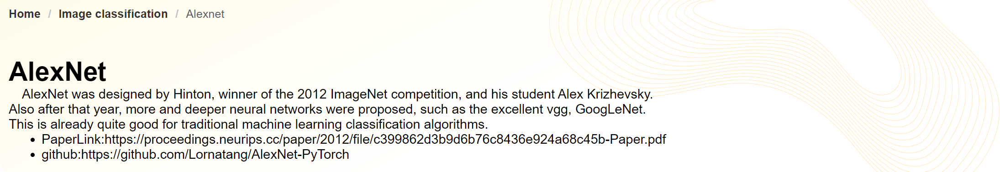

2. 输入部分可选择上传本地图片或直接使用系统提供的样例图片，本地上传支持jpg、gif、jpeg和png格式的图片，单张图片大小最大支持5M；

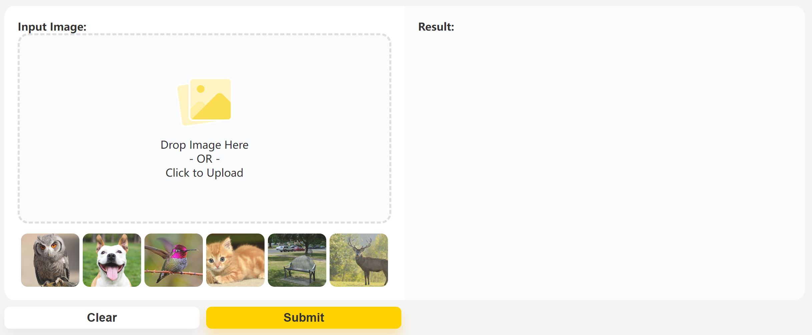

3. 点击**Clear**可清除输入和输出结果，点击**Submit**后模型会对输入图片进行预测，预测结果在右侧显示；在预测过程中点击**clear**可中断计算；

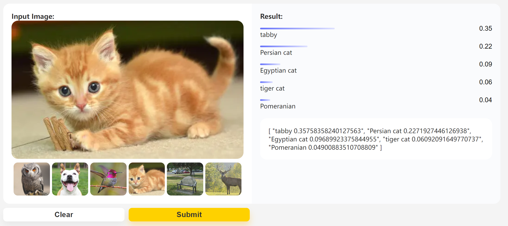

4. 参数模块：部分模型提供参数自定以功能

   - 图像增强部分参数结构如下，function用于选择增强函数，function args用于编辑函数参数，function为参数说明信息；

   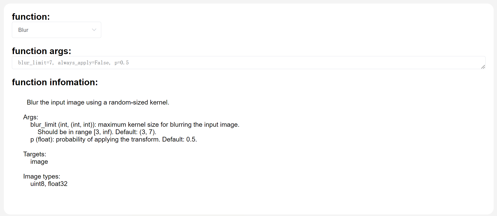

   - Stable Diffusion prompt参数结构如下，目前仅支持英文prompt

   

## 四、模型样例

1. **图像分类**

   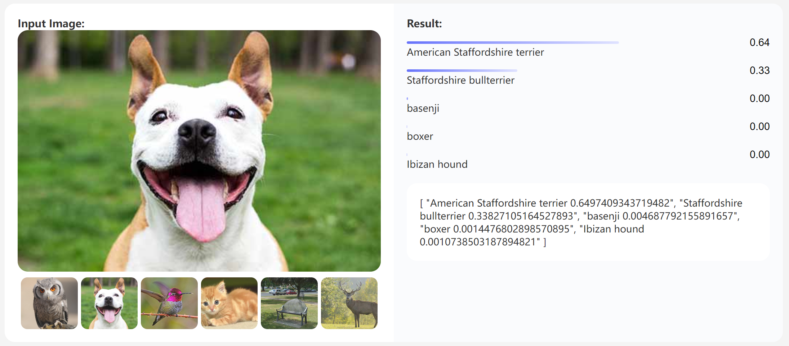

2. **目标检测**

   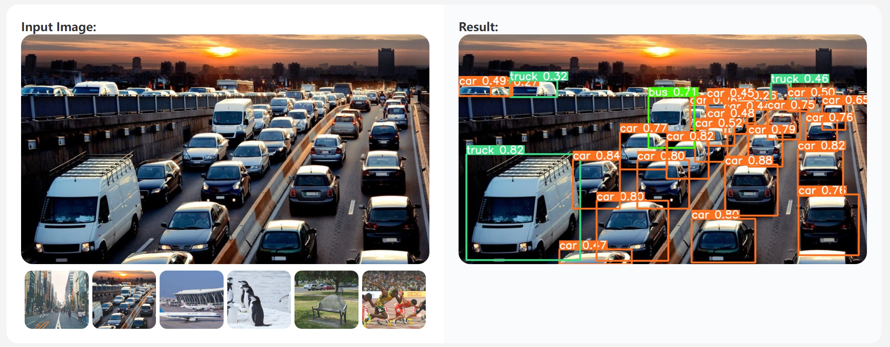

3. **图像分割**

   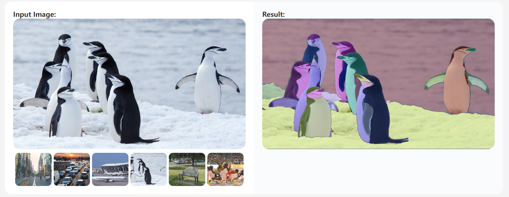

4. **图像增强**

   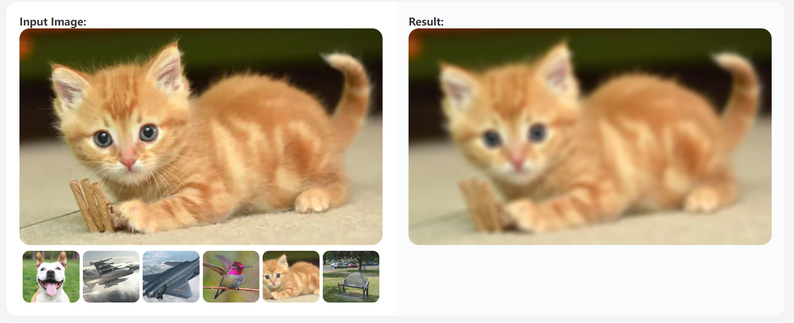

5. **图像处理**

   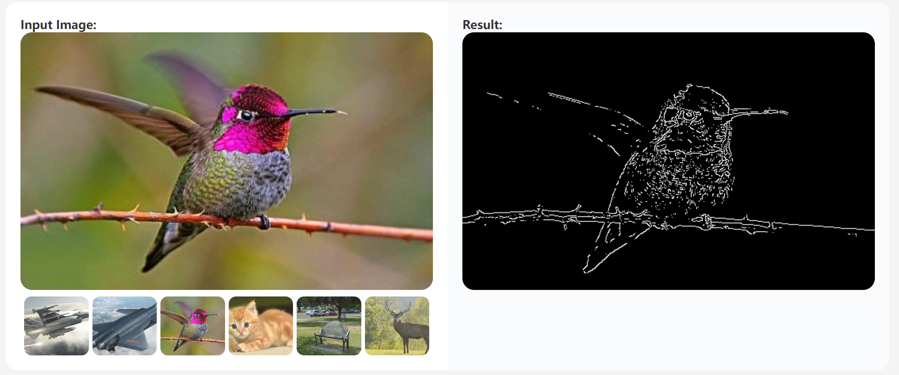

6. **数字水印**

   - 水印嵌入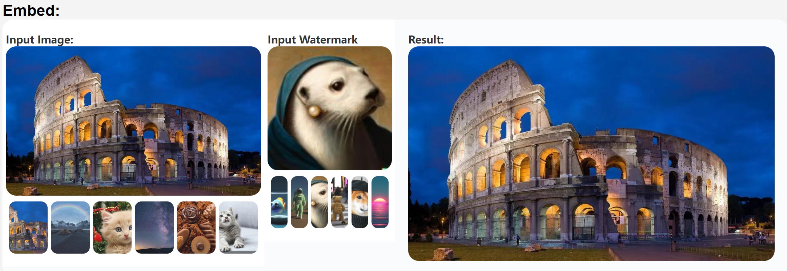

   - 水印提取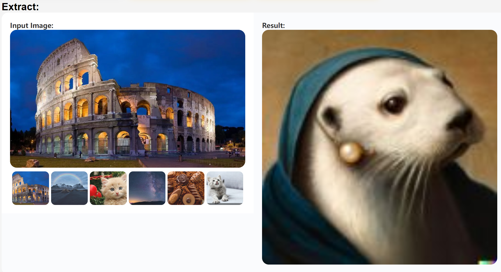

7. **用户建模**

   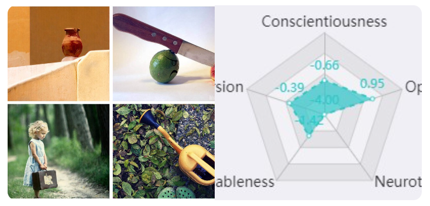

8. **Stable Diffusion**

   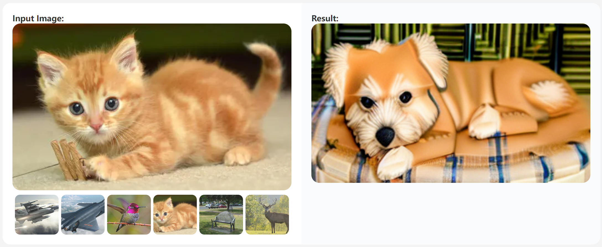
