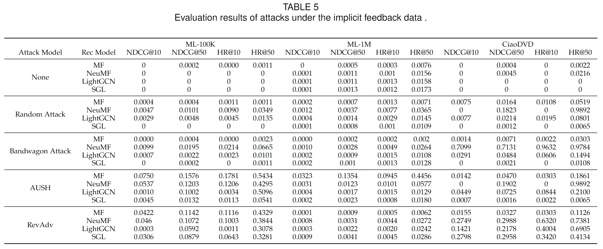

# 面向鲁棒推荐系统：综述和对抗鲁棒评测库

# 深入探讨推荐系统鲁棒性：一项全面综述与新工具介绍

## Towards Robust Recommendation: A Review and an Adversarial Robustness Evaluation Library

作者：程磊、黄晓雯、桑基韬、于剑

项目链接：https://github.com/chengleileilei/ShillingREC

论文链接：https://arxiv.org/abs/2404.17844

## 引言

在信息过载的时代背景下，推荐系统成为了连接用户与信息的桥梁。然而，推荐系统由于其开放性，很容易受到恶意攻击的侵害；此外，训练数据的存在的天然噪声以及数据稀疏等问题，也会降低推荐系统性能。因此，提升推荐系统的鲁棒性越来越成为学术界和工业界的关注焦点。

本文从对抗性鲁棒性和非对抗性鲁棒性两个角度，对推荐系统的稳健性进行了全面的分类和讨论。在对抗鲁棒性部分，文章介绍了推荐系统对抗攻击和防御的基本原理和经典方法；在非对抗鲁棒性部分，本文从数据稀疏、天然噪声以及数据均衡角度对非对抗鲁棒性进行了梳理和探讨。此外，本文还对推荐系统鲁棒性常用数据集和评价指标进行了梳理和汇总。最后探本文讨了推荐系统鲁棒性这一领域目前仍存在的问题和未来可能的研究方向。文章的另一个重要内容是提出了推荐系统对抗鲁棒评测库ShillingREC，该库支持对常见的托攻击模型和基础推荐模型进行公平快速评测。

## 对抗鲁棒性

### 推荐系统托攻击

在电商等平台，推荐系统的输出能够很大程度上影响商家的收益，因此一些恶意商家或用户通过注入恶意数据的方式来操纵推荐系统以获取自身利益，这种攻击方式被称为托攻击Shilling attack。推荐系统托攻击通常追求攻击性和隐蔽性的平衡，即在不被发现的情况下尽可能提升攻击的效果。

从攻击目标来看，托攻击的可以分为有目标攻击和无目标攻击。有目标攻击可分为push和nuke两类。push攻击指通过注入虚假配置文件来提高特定item的受欢迎程度，使target item得到更好的评分或更多的曝光度。nuke攻击指通过注入虚假配置文件降低特定item的受欢迎程度。另一方面，无目标攻击并不针对具体item，而是整个推荐系统，无目标攻击旨在破坏目标推荐系统的整体性能，从而降低平台用户的整体满意度。从使用频率和使用场景来看，有目标攻击实现难度相对更低，更符合实际应用场景，此类工作相对更对多；而无目标攻击由于对攻击者的要求过高，在实际场景中应用较少，但是通常可用于评估某个推荐模型的鲁棒性。

从攻击者执行攻击所需要的知识来看，托攻击分类为白盒攻击、灰盒攻击和黑盒攻击。其中白盒攻击是指攻击者知道受害推荐模型的结构和参数，例如Li 等(2016)提出的针对矩阵分解的托攻击算法PGA和SGLD、Fang 等(2018)提出的针对图推荐系统的托攻击算法SRWA。灰盒攻击指受害模型的推荐算法已知但其参数未知，例如Wu 等(2021)提出的TrialAttack，在只有部分知识的情况下通过爬虫等手段获取的部分数据训练本地模型模拟器，进而进行托攻击。黑盒模型是指攻击者即不知道受害模型的结构，也不了解其参数，例如Zhang 等(2020)提出的LOKI和Song 等(2020)提出的PoisonRec使用强化学习技术实现对黑盒推荐系统的投毒攻击。

虽然不同的托攻击所需要的知识不尽相同，但是托攻击的工作流程基本是相同的。托攻击模型一般需要获取训练数据或交互数据，然后生成虚假交互数据，将虚假数据和原始训练数据合并注入到目标推荐系统中完成攻击，如图所示：

从攻击模型使用的方法不同，我们将托攻击分为基于启发式方法、基于优化方法、基于GAN以及基于强化学习的方法。

### 对抗鲁棒性防御

为了抵抗托攻击的侵害，从推荐系统工作流程考虑，可以在三个方面建立防御机制。首先，可以设置评分门槛防止机器人的恶意评论，例如为推荐平台的评分操作设立验证机制等。其次，在推荐系统训练时，分析托攻击特征构并建恶意攻击检测器，利用检测器过滤干净的数据用于推荐模型训练；最后，可以使用鲁棒性算法开发鲁棒性推荐模型，这类模型在训练过程中能够降低恶意噪声的干扰并学习真实的用户表示。本文对基于检测的方法和基于鲁棒性算法的方法进行了全面介绍。

基于检测的方法根据是否需要监督信号可分为有监督方法、无监督方法和半监督方法。例如，Zhou等提出了一种基于svm的有监督先令攻击检测方法SVM-TIA，该方法训练了一个SVM 有监督分类器并使用Borderline-SMOTE方法来平衡样本，同时采用目标项分析方法，降低了误报率。Hao 和 Zhang(2021)提出一种基于深度学习和社区检测的先令攻击无监督检测方法DC-EDM，DC-EDM首先根据用户行为的相似性构建的用户图，然后使用stacked denoising autoencoders提取鲁棒特征，生成多个聚类结果然后重建用户图，最后利用社区发现方法和相应的指数来检测先令攻击。

虽然基于检测的方法可以在推荐模型训练之前研究攻击特征识别攻击数据进而净化数据，但是其存在一定的局限性：首先，基于检测的方法不能完全过滤恶意攻击；其次，为了追求较高的召回率，基于检测的方法会不可避免的删除正常数据，这会导致数据稀疏等问题。基于此，推荐系统的鲁棒性算法被大量研究，推荐系统鲁棒性算法能够在包含噪声的数据上尽可能学习到用户真实偏好的表示。根据调查，本文将主流的推荐系统鲁棒性算法分为3类，即基于模型的方法、基于对抗训练的方法和基于信任感知的方法。

基于模型的鲁棒性方法是指通过优化或改进模型结构和损失函数等来提升推荐系统鲁棒性的方法。常见方法包括针对MF的鲁棒性算法LTSMF(2010)、RRA-KMF(2014)、SL1-LF(2020)以及使用使用对比学习等无监督信号的SGL(2021)、KRDN(2023)等。

基于对抗训练的方法通过向模型添加对抗性扰动让模型学习到更鲁棒的表示。具体来说，对抗训练是一个最大-最小游戏，在训练过程中最大化对抗扰动产生的损失，最小化推荐任务的损失，这个过程让模型学习在噪声情况下捕获真实的用户偏好，提升推荐鲁棒性。基于对抗训练的经典方法包括He 等(2018)提出的APR、Wu 等(2021)等提出的APT以及用于多媒体推荐的对抗训练方法AMR和ADCFA等。

信任感知推荐算法被广泛应用于推荐系统鲁棒性算法。此类方法尝试获取推荐用户的信任用户或信任商品，以减少恶意攻击的影响。社交数据是一类常用的信任数据，记录了用户之间关注和好友等信息，一些工作利用社交数据挖掘信任信息，然后结合推荐模型提升推荐鲁棒性，最新的工作包括Quan等(2023)提出的GDMSR和Wang等(2023)提出的DSL等。

## 非对抗鲁棒性

除了人为的恶意攻击， 用户无意识的误操作、数据的不合理分布等都可能降低推荐系统的性能，因此，我们将推荐系统在非攻击情况下对抗其他因素导致模型下降的能力称为推荐系统的非对抗鲁棒性。根据调查，我们总结了三个能够影响推荐性能的非对抗鲁棒性因素，包括：

- 数据稀疏导致模型性能下降；
- 隐式反馈中存在的天然噪声，即用户交互过但并不喜欢的noisy positive example和用户未交互过但可能喜欢的noisy negative example；
- 数据分布不均衡可能会误导分类模型的学习过程，进而降低推荐准确性。

面对数据稀疏问题，为了能够在稀疏数据集上学习更准确的表示，可以通过引入外部内容提高数据丰富度，或利用群体推荐思路为稀疏交互的用户推荐商品。例如Li 和 She(2017)提出的一种基于协作变分自动编码器CVAE的贝叶斯生成模型，该模型融合了多媒体场景中的评级和推荐内容。同时以无监督的方式从内容数据中学习深层潜在表示，并从内容和评级中学习项目和用户之间的隐式关系，实验表明CVAE缓解了数据稀疏和冷启动问题。Yang 等，(2022)将知识图数据与对比学习结合，利用知识图中丰富的数据学习稀疏交互用户的真实偏好，进而提升了推荐准确性。

在隐式反馈推荐任务中，以电商为例，用户可能因为好奇心点击一个商品但并不打算购买该商品，或者由于某些商品流行度过低用户没有浏览到其感兴趣的商品。因此，盲目地将隐式反馈拟合到推荐系统而不考虑固有噪声将无法理解用户的真实偏好，最终损害用户体验并降低推荐性能。 基于此，隐式反馈推荐系统的去噪十分重要，根据调查，我们将隐式反馈去噪任务分为样本采样和样本重加权。样本选择注重于设计合理的采样器过滤干净的样本来学习用户的偏好，这类方法的推荐性能依赖于采样器的性能，常见的方法包括WBPR(2011)、IRBPR(2021)和GDNS(2022)。虽然样本选择能够一定程度上解决饮食反馈推荐系统中的噪声问题，但其可能会由于追求过高的召回率而不可避免的删除真实样本，同时该类方法的性能还严重依赖于数数据分布。因此，一系列基于样本重加权的隐式反馈去噪方法被提出。样本重加权方法根据样本损失值来区分干净样本和噪声样本，在模型训练期间为噪声样本设置更低的权重，常见的方法包括SRRMF(2019)、ADT(2022)、DeCA(2022)、和SGDL(2022)等。

推荐系统由于其本身机制会导致负例样本的数量远远大于正例样本的数量，使用不平衡的数据训练模型可能会导致模型偏向于预测出现频率较高的类别进而降低模型性能，同时大量无用数据也会增加模型训练时间。因此为了解决样本分布问题，Yang 等(2018)提出非对称矩阵分解推荐模型ROMA，将成本敏感学习结合限制单边损失集成到联合目标函数中；使得模型更加关注正类别的预测，从而在处理不平衡数据时提高了模型的性能。

## ShillingREC

ShillingREC的框架结构如图所示。ShillingREC同时支持对隐式反馈数据和显式反馈数据进行注入攻击，同时支持对常见的推荐模型进行鲁棒性评估。我们首先在显式反馈数据上对各类推荐模型的鲁棒性进行了评测。接着在隐式反馈数据上评估了各类攻击模型的性能，实验结果如下：

从评测结果可以看出，推荐系统托攻击方法对数据集大小敏感。一般来说，托攻击对小规模数据集的效果比在大规模数据集上的效果更好。此外，相比于有监督的推荐模型，引入无监督信号的SGL鲁棒性更为优秀，分析原因是无监督信号在学习过程中会过滤掉一些异常数据。对于攻击模型，相比于启发式方法，例如Random attack，基于优化和基于模型的攻击方法（AUSH和RevAdv）攻击效果更好。

## 讨论

从数据层面来说，对抗鲁棒性推荐算法的研究缺少真实场景下的虚假用户数据，因此目前的学术研究都是人工模拟的虚假用户，这一设置无法保证开发的鲁棒性推荐算法在实际生产环境生效。此外，由于推荐系统隐私和平台规则等一些限制，推荐系统托攻击模型存在攻击内容有限的问题，即目前只能模拟user-item-rating数据，无法构造其他类模拟。并且对抗攻击作为推荐系统对抗鲁棒性的上游任务，这在一定程度上会限制鲁棒性推荐算法的研究。

从方法角度来说，虚假检测是推荐系统对抗鲁棒性的一个重要方法，但是基于虚假检测的方法在追求过高召回率时无法避免样本误判，这极有可能导致后续推荐模型训练效果变差，将虚假检测任务与推荐任务联合训练是一个可行的思路，GraphRfi 、PDR 等工作在这一领域做了初步探索。

 此外，对于推荐系统非对抗鲁棒性，目前对天然噪声的去噪研究相对较多，但是这些工作针对的场景相对单一，无法同时面对数据均衡、采样偏差以及天然噪声等问题，因此General-purpose robust推荐算法是一个重要问题。

## 常见鲁棒性推荐任务数据集和开源推荐库汇总

(#Star 表示该项目在github的star数量，数据统计时间为2024年4月21日)